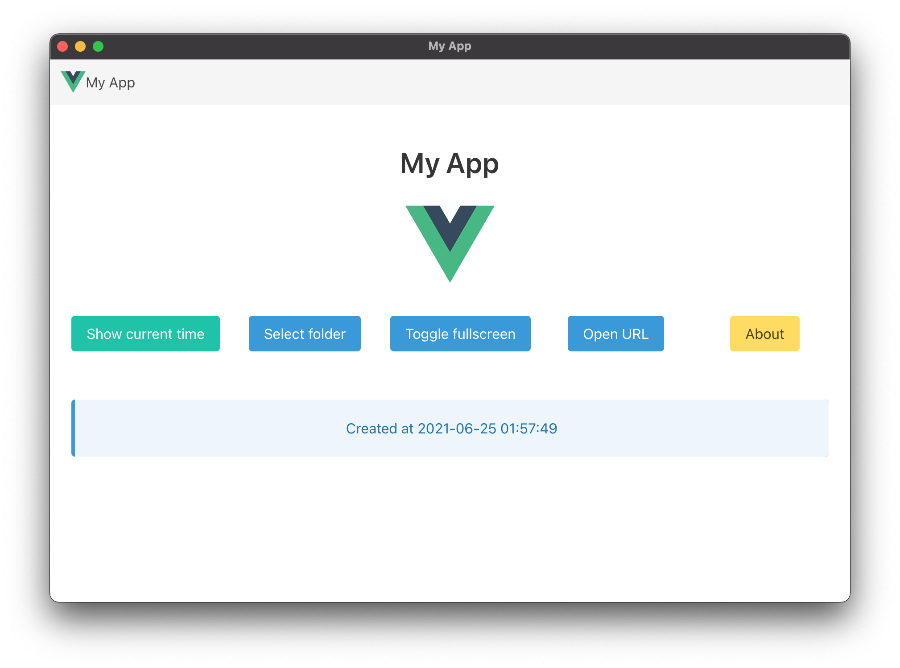
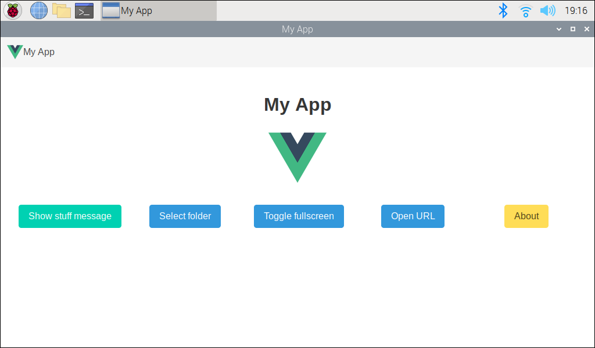

# PyInstaller Cross-Platform Sample

[](https://github.com/paulo-coutinho/pyinstaller-sample/actions/workflows/linux.yml)
[](https://github.com/paulo-coutinho/pyinstaller-sample/actions/workflows/windows.yml)
[](https://github.com/paulo-coutinho/pyinstaller-sample/actions/workflows/macos.yml)

In this sample you can learn about generate desktop application with: Python + Flask + Vue 3.

## Screenshots

<p align="center">
    
    <br>
    macOS
</p>

<p align="center">
    
    <br>
    RaspberryPi 3
</p>

## Download

You can download a compiled version for your system on releases page or actions page.

## Python and Javascript Integration

You can call any Python module using our API class that is a proxy for load module in runtime.

On Javascript side you need call something like this:

```javascript
pywebview.api
.call("modules.datetime.get_now", { timestamp: new Date().getTime() })
.then((result) => {
    this.message = result;
})
.catch((e) => {
    this.message = "Error: " + e;
});
```

The method `pywebview.api.call` called in javascript has two parameters:

* function name: is the full path of module, example: `package.module.func_name`
* params: is optional, but can be any type of param

On Python side, the above example will load the module `src/backend/modules/datetime.py` and will call function `get_now` inside it with the params `{ timestamp: 1234567890 }`.

The result of function `get_now` will be received on promisse `.then((result) => {}` and the exception will be caught on `.catch((e) => {}`.

## PyInstaller

Make sure that you added all your modules on `My App.spec` in `hiddenimports` list.

## Linux ARM V7 (32bit)

To generate Linux ARM V7 version you need install some system libraries:

`sudo apt install python-gi python-gi-cairo python3-gi python3-gi-cairo gir1.2-gtk-3.0 gir1.2-webkit2-4.0`

And use this pyinstaller version:

`pip3 install https://github.com/pyinstaller/pyinstaller/releases/download/v4.3/pyinstaller-4.3-py3-none-linux_armv7l.whl`

## Windows

Windows generally detect all not signed EXE as a malware by their security system (Microsoft Defender, SmartScreen etc). This false positive detection can be ignored if you add an exclusion on Windows Security. You can add entire folder making all files and subfolders not to be treated this way.

To learn how to **add an exclusion**, see Microsoft tutorial:

https://support.microsoft.com/windows/add-an-exclusion-to-windows-security-811816c0-4dfd-af4a-47e4-c301afe13b26

You can submit a file for malware analysis on Microsoft tool checker:

https://www.microsoft.com/wdsi/filesubmission

You can read more on Microsoft developer FAQ:

https://docs.microsoft.com/windows/security/threat-protection/intelligence/developer-faq

Do buy the certificate you can search on Google about companies that sell EV Code Signing Digital Certificates or go to Digicert website:

https://www.digicert.com/signing/code-signing-certificates

Some tutorials about how to signing your EXE is here:

* https://www.digicert.com/kb/code-signing/signcode-signtool-command-line.htm
* https://www.digicert.com/kb/code-signing/code-signing-winqual.exe-file.htm

Other companies that sell EV Code Signing Certificates:

* https://www.ssl.com/certificates/ev-code-signing/
* https://shop.certum.eu/data-safety/code-signing-certificates/certum-ev-code-sigining.html
* https://www.entrust.com/digital-security/certificate-solutions/products/digital-signing/code-signing-certificates
* https://www.globalsign.com/en/code-signing-certificate/ev-code-signing-certificates
* https://sectigo.com/ssl-certificates-tls/code-signing

Other option is publish your application on Microsoft Store. See some tutorials:

* https://docs.microsoft.com/windows/apps/desktop/modernize/desktop-to-uwp-distribute
* https://docs.microsoft.com/windows/msix/packaging-tool/create-an-msix-overview
* https://docs.microsoft.com/windows/win32/win_cert/windows-certification-portal
* https://www.electronjs.org/docs/tutorial/windows-store-guide
